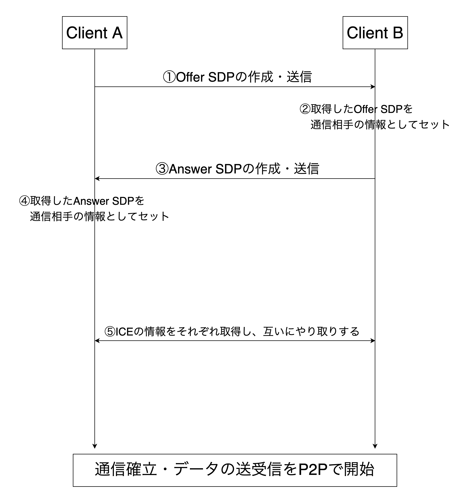

# シグナリングのコード解説

下の図はWebRTCで通信を確立するまでのフローを表した図です。

実際の通信ではSDPのやり取りなどはシグナリングサーバーを介して行われます。



## 1. Offer SDPの作成・送信
まず、通信を始めたいClient AがClient Bに対してOffer SDPを送信します。

以下がその部分の処理を行うための関数です。

```typescript
export const createOffer = async (
  connection: RTCPeerConnection,
  channel: Channel,
  user: UserType
) => {
  const offer = await connection
    .createOffer({ offerToReceiveVideo: true })
    .catch((description) => {});

  if (offer) {
    await connection.setLocalDescription(offer).catch((error) => {
      console.error("[createOffer] create Offer Error");
      console.error(error);
    });
    console.log("[createOffer] set offer to local");
    sendSDP({ userId: user.id, description: offer }, channel);
  }
};
```

## 2. Offer SDPのセット
Client Bが接続を承認するなら受信したOffer SDPをClient Bの通信相手としてセットします。
以下がその部分の処理を行うための関数です。

```typescript
export const setOffer = async (
  connection: RTCPeerConnection,
  offer: RTCSessionDescriptionInit,
  user: UserType
) => {
  await connection.setRemoteDescription(offer).catch((error) => {
    console.error("[setOffer] setRemoteDescripion error");
    console.error(error);
    return;
  });
  console.log("[SET OFFER]");
};
```

## 3. Answer SDPの送信
2の処理が完了したら、次に、Client BからClient AへAnswer SDPを送信します。
以下がその処理を行う関数です。

```typescript
export const createAnswer = async (
  connection: RTCPeerConnection,
  channel: Channel,
  user: UserType
) => {
  const answer = await connection.createAnswer().catch();
  await connection.setLocalDescription(answer).catch((error) => {
    console.log(error);
  });
  console.log("[createAnswer] set answer to local");
  sendSDP({ userId: user.id, description: answer }, channel);
};
```

## 4. Answer SDPのセット
Client AがClient BからのAnswerを受信したら、そのSDPをセットします。
以下がその部分の関数です。

```typescript
export const setAnswer = async (
  connection: RTCPeerConnection,
  answer: RTCSessionDescriptionInit
) => {
  await connection.setRemoteDescription(answer).catch((error) => {
    console.error("[setAnswer] setRemoteDescripion error");
    console.error(error);
    return;
  });
  console.log("[SET ANSWER]");
};
```

## 5. ICE情報のやり取り
便宜上⑤としていますが、実際には上の処理と並行してICE candidateの情報を収集し、
その情報をClient間で共有しています。

以下がその部分のソースコードです。
```typescript
connection.onicecandidate = (event) => {
  if (event.candidate) {
    const candData: CandDataType = {
      userId: me.id,
      candidate: event.candidate,
    };
    channel.push("ice", candData);
    console.log("[ON ICE] send ice candidate");
  } else {
    console.log("ice candidate data is ready");
  }
};
```

## 6. P2P通信開始
1~5の処理が終わったら、晴れてP2P通信の開始です。